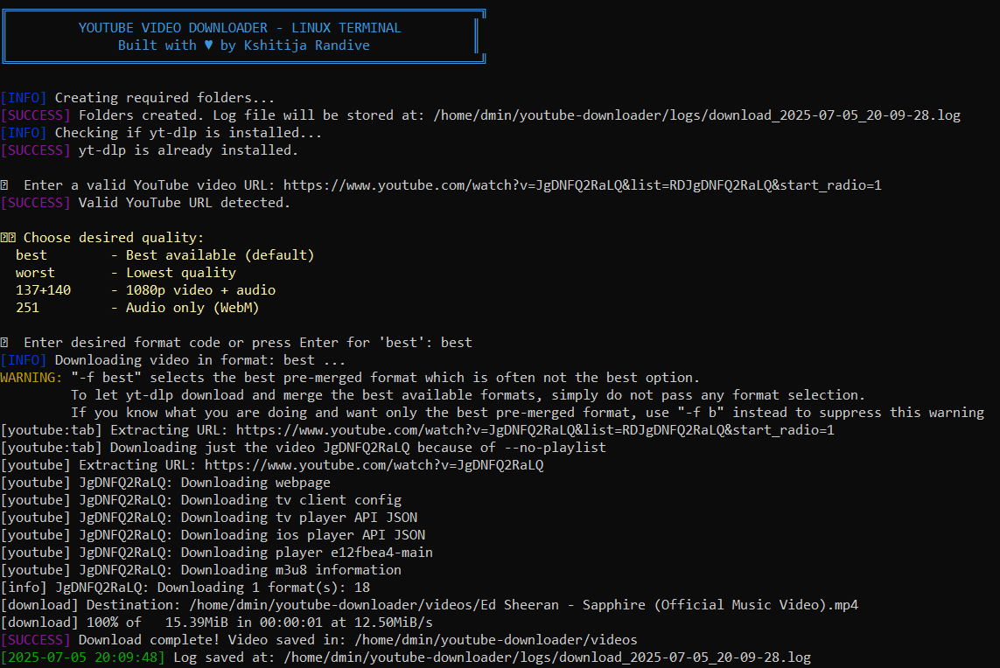

# 🎬 YouTube Downloader - Linux Terminal Version

[](https://www.gnu.org/software/bash/)
[](LICENSE)


A professional, DevOps-style Bash script for downloading YouTube videos on Linux using `yt-dlp`.

---

## 🚀 Features

- 🎥 YouTube video download with resolution selection
- ✅ URL validation & playlist restriction (`--no-playlist`)
- 📁 Auto-create folders and logs
- 🔄 Auto-installs `yt-dlp` if missing
- 🖥️ Color-coded banner & status output

---

## 📦 Requirements

- Linux environment
- `yt-dlp` (auto-installed)
- Bash shell

---

## 🔧 How to Use

```bash
chmod +x youtube-downloader.sh
./youtube-downloader.sh
```

---

## 📂 Folder Structure

```
YouTube-Downloader-Linux/
├── youtube-downloader.sh
├── README.md
├── LICENSE
├── .gitignore
```

---

## 📸 Screenshot



---

## 🧑‍💻 Author

**Kshitija Randive**  
DevOps Engineer | GCP | AWS | CI/CD | Linux Automation

---

## ⚖️ License

This project is licensed under the MIT License - see the [LICENSE](LICENSE) file for details.

---

> Built with ♥ for DevOps practice and Linux terminal automation.
